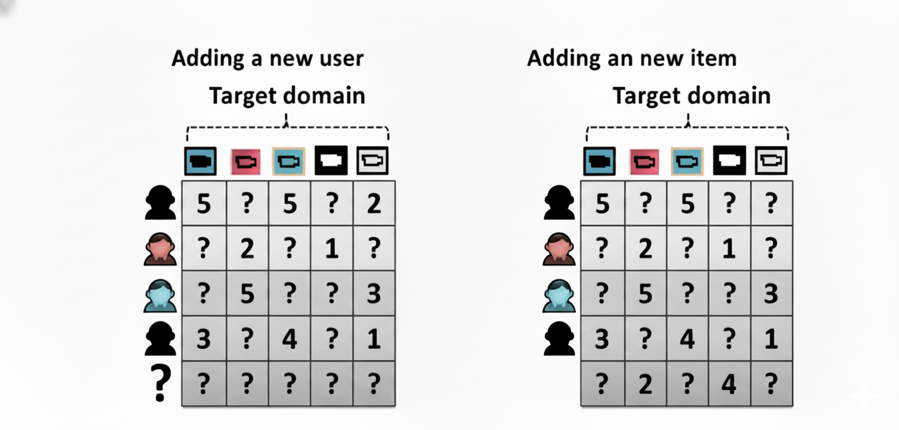
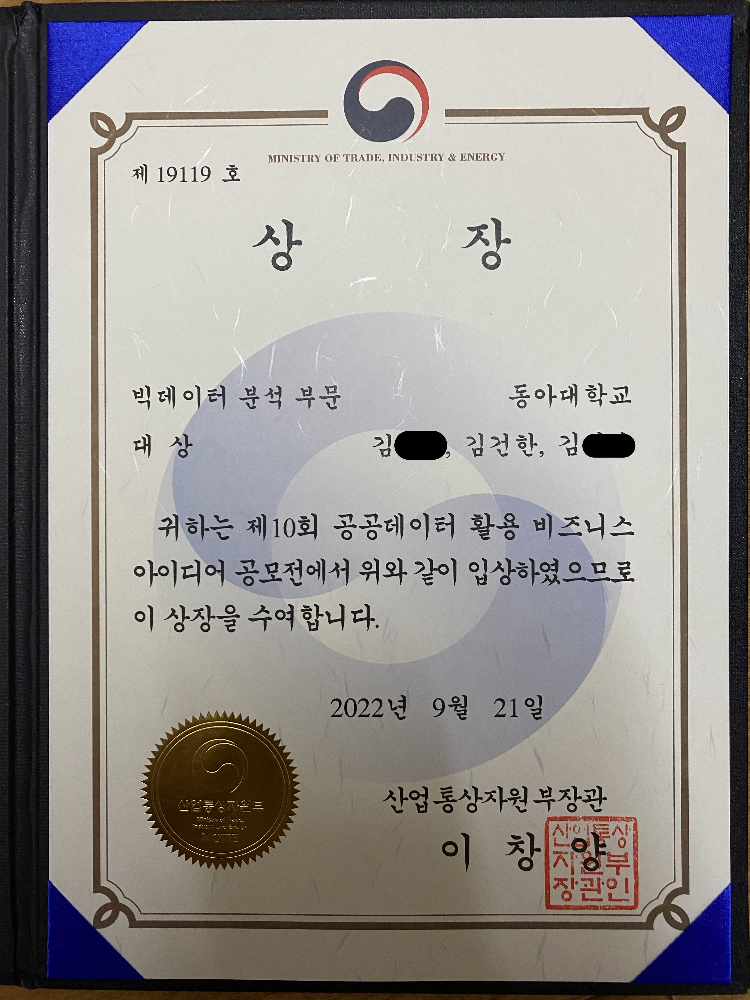
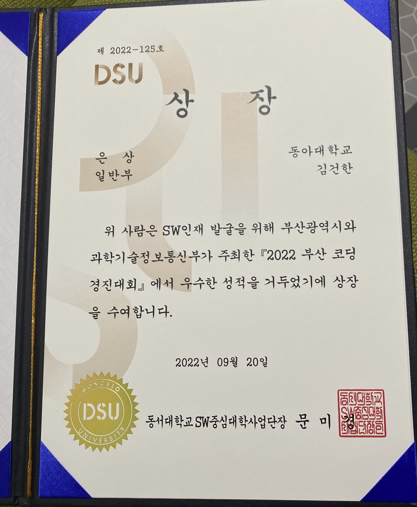
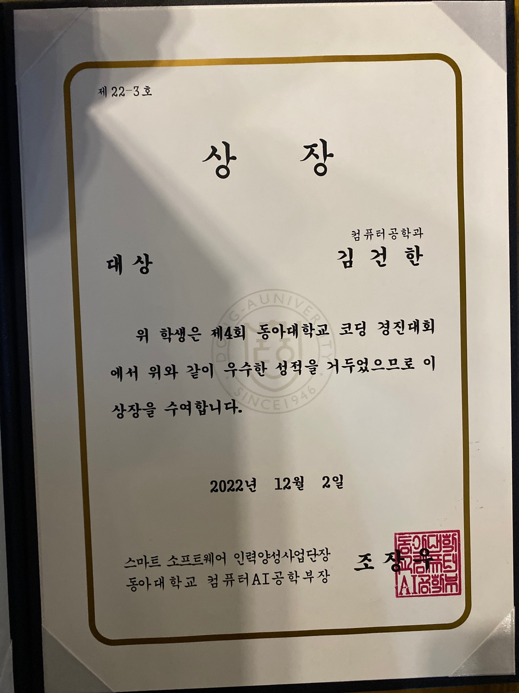
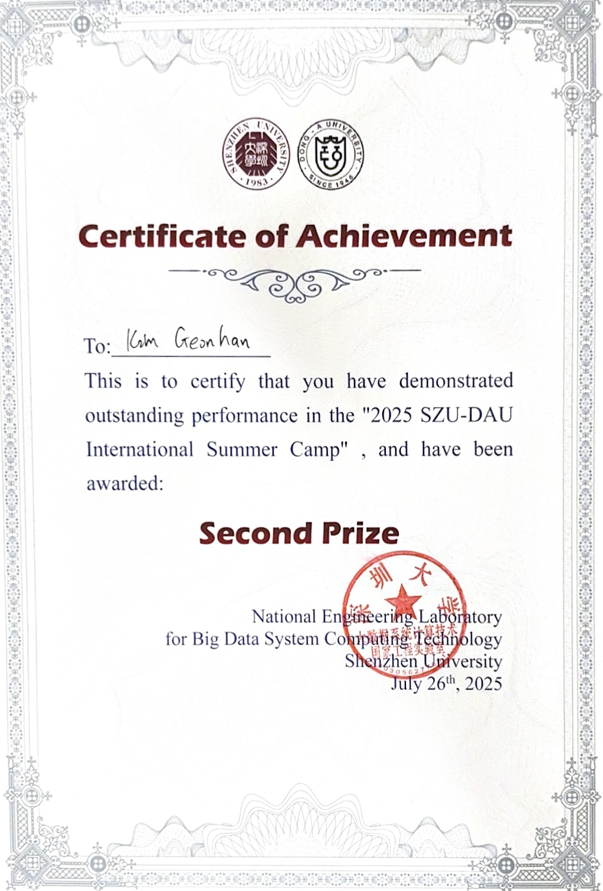

**Developer & Undergraduate Researcher**  
Recommender systems · Digital twin

---

I'm a developer with ~6 years

1. **On-Campus Activities**  
   - **Undergraduate Researcher, Data Science Lab (2022–Present)** — Analyzed **solar power potential on abandoned railways** and optimized distributed energy systems using Python (Pandas, NumPy, Matplotlib, Folium)  
   - **DUCC Grand Prize** — Demonstrated strong algorithmic problem-solving skills  
   - **Extracurricular** — Participated in a **data-driven corporate problem-solving project** for local industries  

2. **Team Projects**
   - **Digital Twin Backend Development (2024)** — Built a **virtual interaction computation backend** using *Unreal Engine* for digital twin simulations
   - **Arduino Obstacle Detector (2022)** — Built using ultrasonic sensors at *PathHack Hackathon*  
   - **Algorithm Contest Problem Setter (2022)** — Designed test sets and verified problem logic
   - **Local Market Revitalization App (2020)** — *Smart App Challenge* qualifier  
   - **Reinforcement Learning Omok AI (2020)** — *Maker Program* project; published on GitHub  

4. **External Activities**  
   - **SW Maestro Applicant (2022)** — Passed document screening and two coding tests; **final interview not passed**  
     - Gained insights on portfolio building and practical preparation  

## Research Focus
- Cold-start problem in recommender systems
  

## Awards
- 10th MOTIE Public Data Utilization BI Contest (Big Data Analysis) — **Grand Prize**
- Busan Coding Competition — **Silver Prize**
- Dong-A University Coding Competition (DUCC) — **Grand Prize**
- 2025 SZU-DAU International Summer Camp - **Second Prize**

  
  
  
  

## Education
- **Dong-A University**, B.S. in Computer Science (Expected 2028) — Undergraduate researcher, Data Science Lab  
- **Dongnae High School**, (2019–2022)

## Certifications
- **Network Manager, Level 2** (Korea Information & Communication Qualifications Association)  
- **Craftsman Information Processing** (HRDKorea)

## Solved.ac
 

## Links
- Blog: https://gokimkh.tistory.com/  
- Homepage: https://gokimkq123.github.io/CV.github.io/
